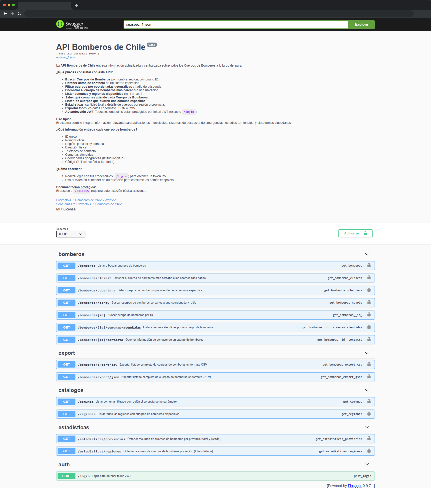
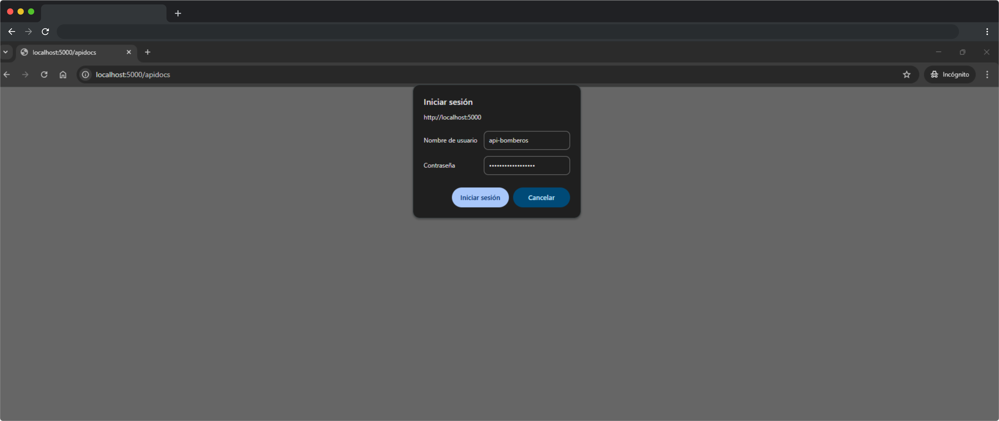
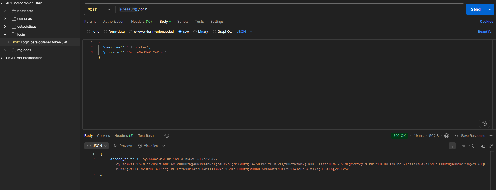
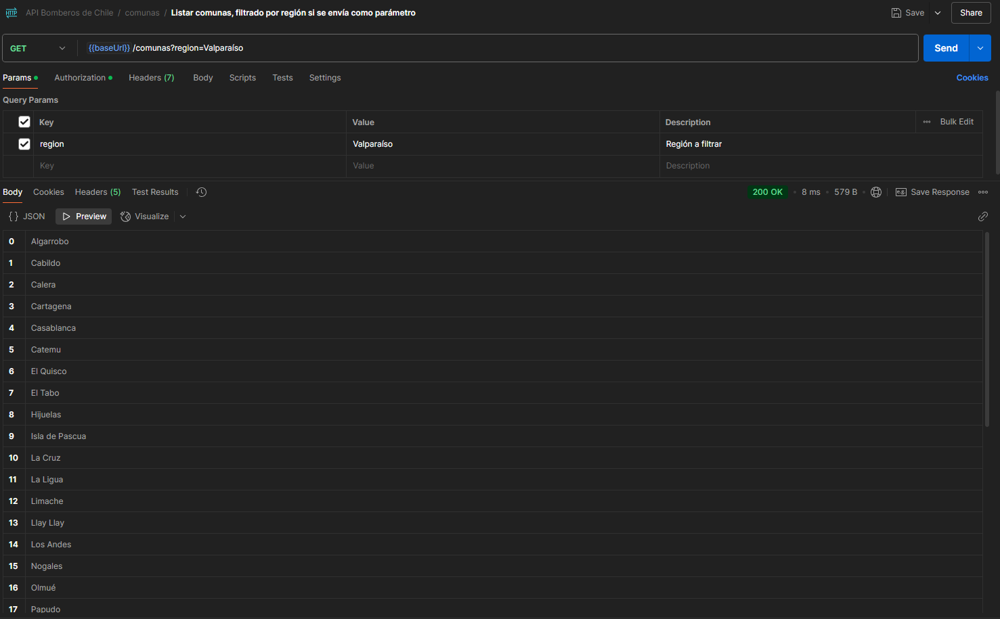
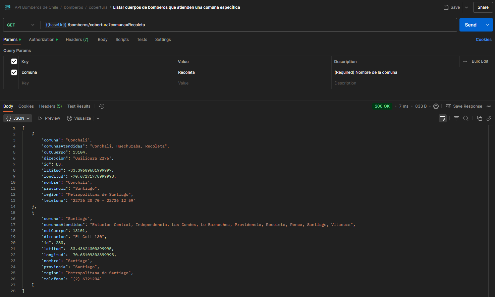
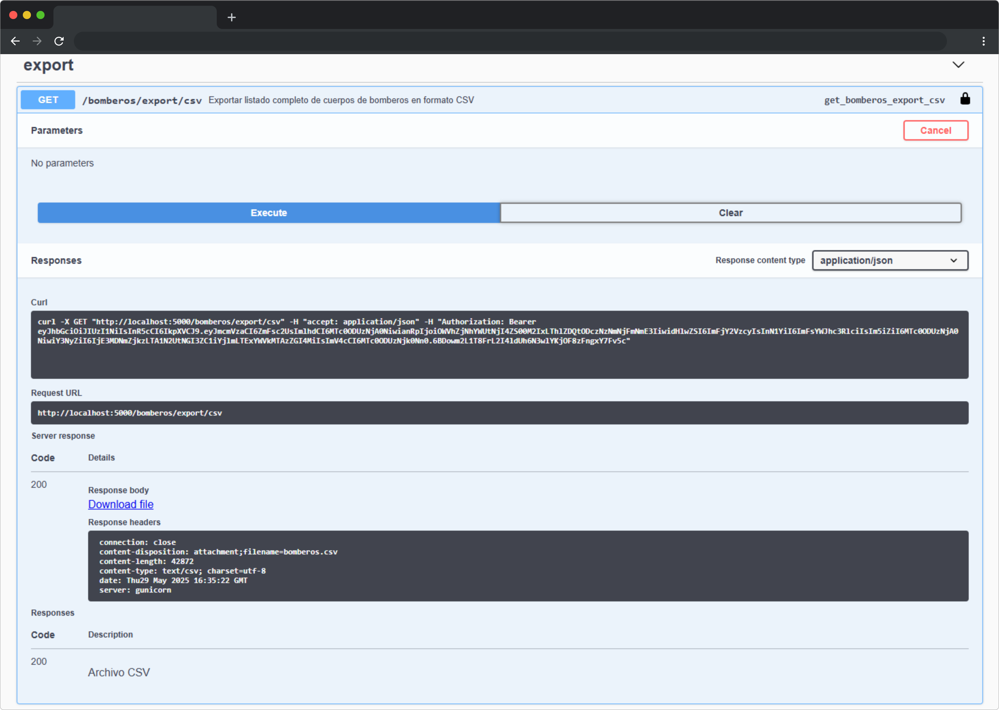

# 🚒 API Bomberos de Chile

Bienvenido a la **API Bomberos de Chile**, una plataforma REST que entrega información completa, centralizada y actualizada sobre todos los Cuerpos de Bomberos del país. Pensada para ser consumida por aplicaciones de gestión municipal, sistemas de despacho, proyectos ciudadanos, y cualquier iniciativa que requiera acceso rápido y seguro a esta valiosa base de datos nacional.

---

## 📚 ¿Qué puedes hacer con esta API?

- 🔍 Buscar Cuerpos de Bomberos por nombre, región, comuna o ID.
- 🗺️ Encontrar el cuerpo de bomberos más cercano a unas coordenadas o dentro de un radio definido.
- 📊 Obtener estadísticas y resúmenes por región o provincia.
- 📦 Exportar el listado completo en formato **JSON** o **CSV**.
- 📒 Consultar todas las comunas y regiones disponibles.
- 🏢 Saber qué comunas atiende cada Cuerpo de Bomberos.
- 📞 Obtener información de contacto oficial.
- 🔒 Todas las rutas están protegidas por autenticación **JWT** (excepto `/login`).
- 🔐 El acceso a la documentación Swagger (`/apidocs`) también está protegido por autenticación básica HTTP.

---

## 🛠️ Tecnologías utilizadas

- [Python 3.11+](https://www.python.org/)
- [Flask](https://flask.palletsprojects.com/)
- [Flasgger](https://flasgger.pythonanywhere.com/) (Swagger UI para Flask)
- [Flask-JWT-Extended](https://flask-jwt-extended.readthedocs.io/) (autenticación JWT)
- [Flask-Limiter](https://flask-limiter.readthedocs.io/) (protección contra fuerza bruta en login)
- [Gunicorn](https://gunicorn.org/) (servidor WSGI para producción)
- [Docker & Docker Compose](https://www.docker.com/)

---

## 🚀 Instalación rápida

### 1. Clona el repositorio

```bash
git clone https://github.com/matiasua/api-bomberos-cl
cd api-bomberos-chile
```
---
### 2. Ajusta las variables de entorno

#### Puedes crearlas en tu .env o directamente en el archivo docker-compose.yml.

```bash
Variables clave:
 - ADMIN_USER y ADMIN_PASS: usuario y contraseña para obtener el JWT.
 - JWT_SECRET_KEY: clave secreta de tu JWT.
 - DOCS_USER y DOCS_PASS: usuario y clave para acceder a /apidocs.
```

#### Ejemplo .env:

```bash
ADMIN_USER=admin
ADMIN_PASS=admin123
JWT_SECRET_KEY=super-secret-key
DOCS_USER=docsuser
DOCS_PASS=docspass
```
---

### 3. Construye y levanta la API con Docker Compose

```bash
docker compose build
docker compose up
```
Por defecto, la API quedará disponible en http://localhost:5000

---

## ⚙️ Variables de entorno obligatorias

| Variable          | Descripción | Ejemplo |
| :---------------- | :------: | ----: |
| ADMIN_USER        |   Usuario administrador para login JWT   | alabaster |
| ADMIN_PASS        |  Contraseña administrador para login JWT   | 6vuJeNeB4eVlXAXzmf |
| JWT_SECRET_KEY    |  Clave secreta JWT   | 0XITm3sMGmJ9J72MffFvcKJTh_R0xtWnrAMm4mIpeRI |
| DOCS_USER |  Usuario para autenticación básica en /apidocs   | api-bomberos |
| DOCS_PASS |  Contraseña para /apidocs   | k1YapvZ01i2yYHjQMa |

---

## 🗝️ Acceso y autenticación

### 1. Obtener un token JWT

#### Realiza un POST a /login con tus credenciales:

```bash
{
  "username": "alabaster",
  "password": "6vuJeNeB4eVlXAXzmf"
}
```

#### Si las credenciales son válidas, recibirás un access_token que debes usar en las siguientes peticiones.
---
### 2. Acceso a los endpoints protegidos

#### Incluye el token en el header:
```bash
Authorization: Bearer TU_TOKEN_AQUI
```
---
### 3. Acceso a la documentación Swagger

#### Ve a http://localhost:5000/apidocs
#### Ingresa usuario y contraseña (DOCS_USER y DOCS_PASS).
---
## 📑 Endpoints principales

| Método          | Ruta | Descripción |
| :---------------- | :------: | ----: |
| POST        |   /login   | 	Login y obtención de token JWT |
| GET        |  /bomberos   | Listar o buscar cuerpos de bomberos |
| GET    |  /bomberos/&lt;id&gt;   | 	Buscar cuerpo de bomberos por ID |
| GET |  /bomberos/nearby   | Buscar cuerpos cercanos a coordenadas y radio |
| GET |  /bomberos/closest   | Cuerpo más cercano a coordenadas |
| GET        |   /bomberos/cobertura   | 	Cuerpos que atienden una comuna específica |
| GET        |  /bomberos/&lt;id&gt;/comunas-atendidas  | Comunas que atiende el cuerpo específico |
| GET    |  /bomberos/&lt;id&gt;/contacto  | 	Información de contacto del cuerpo |
| GET |  /estadisticas/regiones   | Estadísticas de cuerpos por región |
| GET |  /estadisticas/provincias  | Estadísticas de cuerpos por provincia |
| GET        |  /comunas  | Listar comunas (puedes filtrar por región) |
| GET    |  	/regiones   | 	Listar todas las regiones disponibles |
| GET |  /bomberos/export/json   | 	Exportar datos completos en formato JSON |
| GET |  /bomberos/export/csv  | Exportar datos completos en formato CSV |


#### Más detalles y ejemplos de uso en la documentación Swagger UI (/apidocs).
---

## 🖼️ Vistas de la API

### Documentación Swagger UI


### Ejemplo de login


### Obtención de token JWT


### Ejemplo de respuesta de búsqueda por región y cobertura




### Exportación a CSV


---

## 💡 Consideraciones importantes

- **Modo producción**: Usa Gunicorn, no el servidor Flask incorporado.
- **HTTPS**: Recomendado publicar detrás de un proxy con SSL si la API será pública.
- **Rate limiting**: El endpoint /login está limitado a 5 intentos por minuto por IP.
- **Protección de documentación**: La UI de Swagger (/apidocs) está protegida por autenticación básica.
- **Variables sensibles**: ¡No subas tus claves ni secretos a repositorios públicos!
- **Licencia**: MIT.

---
## 🙌 Colabora

¡Tus sugerencias, PR y aportes son bienvenidos!
Si encuentras errores, tienes ideas de mejora o quieres sumar más datos, por favor abre un issue o pull request.

---
## 📬 Contacto
- **Web**: [M4S Techonology](https://www.m4s.cl/)
- **Email**: contacto@m4s.cl
